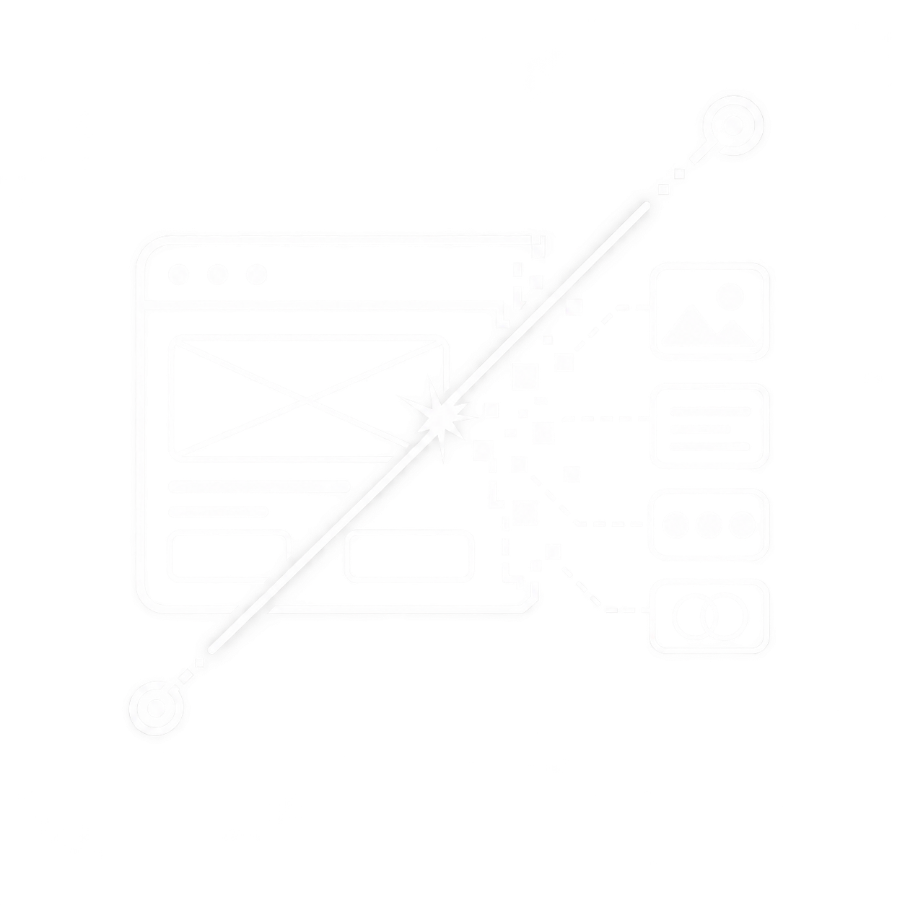
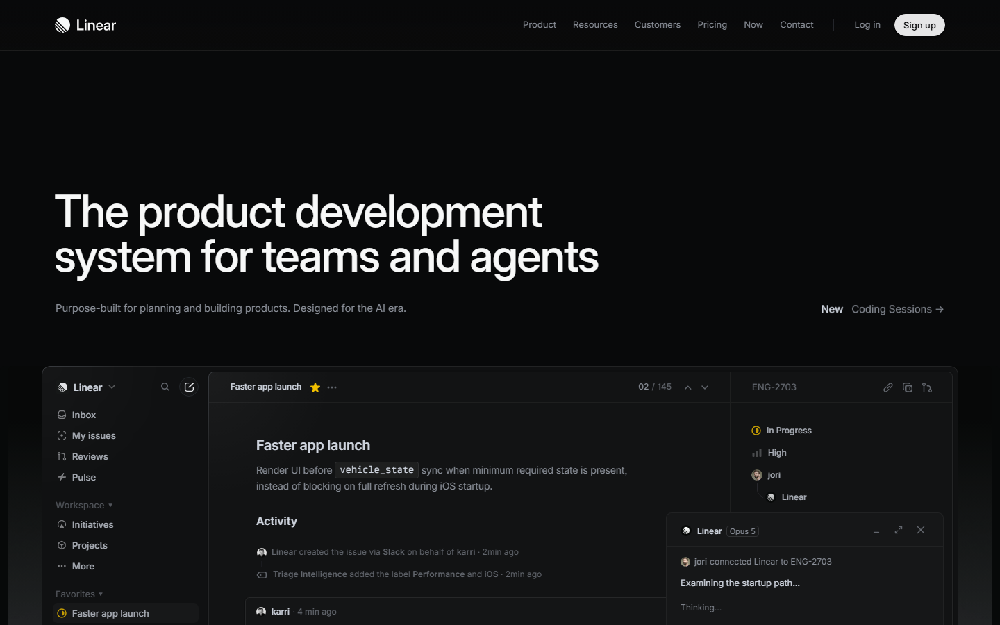
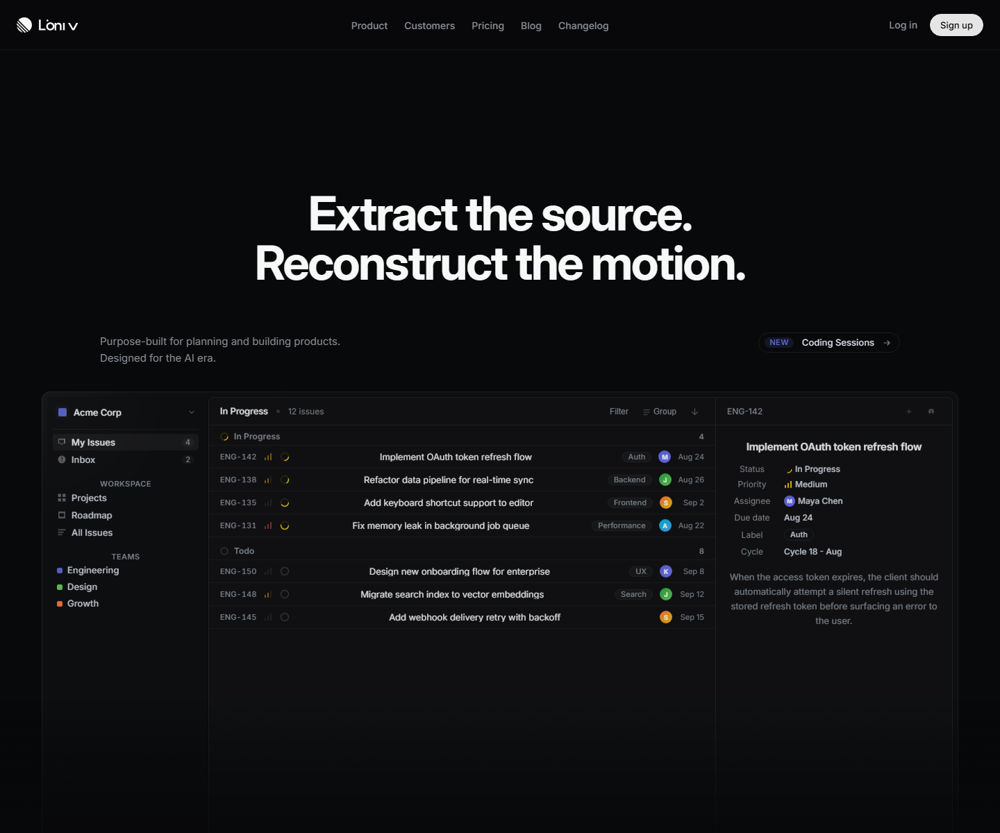

<p align="center">
  
</p>

<h1 align="center">design-extractor</h1>

<p align="center">
  Stop copying pixels. Screenshots miss the motion. Extract the actual source, computed tokens, and runtime behavior.
</p>

<p align="center">
  <a href=".">=18"></a>
  <a href="./LICENSE"></a>
  <a href="."></a>
</p>

---

## Why

Screenshot tools give you pixels. They miss source architecture, animation timing, runtime DOM, and interaction state. These parts determine how a design works.

design-extractor captures both signals: downloaded source files and a live Playwright browser pass. It merges them into one reference folder and one doc ready for a redesign build or taste-library intake.

## Setup

#### Claude Code

Run inside your workspace to install:
```bash
/plugin marketplace add alfar1zi/design-extractor
/plugin install design-extractor@design-extractor
```
Now trigger via `/design-extractor <url>`.

#### OpenCode

Add the plugin entry to `~/.config/opencode/plugins.json` pointing to this repository. Trigger via `/design-extractor <url>`.

#### Hermes

Run the installation script `install.sh`. The command is registered globally to the Hermes shell.

#### Cursor

Add the path to `skills/design-extractor/SKILL.md` to your Cursor Rules (`.cursorrules`). The agent reads it on demand when design tasks are requested.

## Pipeline

| Slash Command | What it does | Output artifact |
| --- | --- | --- |
| /design-extractor-find | Query the web for candidate URLs matching a design prompt | list of URLs to stdout |
| /design-extractor-save | Download full site via saveweb2zip: HTML, CSS, JS, images, fonts | `site/` folder |
| /design-extractor-inspect | Drive Playwright: scroll, interactions, viewport sweep, token dump | `live/` folder |
| /design-extractor | Run the full extraction pipeline (including layout/token merge) | `REFERENCE.md` |

Skip `/design-extractor-find` if you have a URL. Skip `/design-extractor-save` if you only need live screenshots. `/design-extractor` merges all artifacts at the end.

Once installed, trigger the capture directly inside your agent chat:
```bash
/design-extractor https://linear.app --out ./refs/linear
```

<details>
<summary>CLI Fallbacks (local)</summary>

Save and inspect separately (Note: Not yet published to npm. Run from clone with `node scripts/<name>.mjs`):
```bash
node scripts/saveweb2zip.mjs --url https://linear.app --out ./refs/linear --rename-assets
node scripts/inspect.mjs --url https://linear.app --out ./refs/linear/live --viewport 1440x900
```

Add `--record-video` to capture the scroll pass as `.webm`. Add `--site-dir` to scan JS for animation libs.

Discover candidates first:
```bash
node scripts/find-refs.mjs --prompt "premium saas landing dark theme" --count 5
```

**Backend recommendation**: set `BRAVE_API_KEY` and use `--backend brave` (or `--backend auto` with the key set). The DuckDuckGo backend scrapes HTML without an API key but is fragile (markup changes break the parser; we now throw a distinct "DuckDuckGo HTML markup changed; parser needs update" error so you can tell parser miss apart from a genuine zero-result query) and brittle (ToS gray area, easy rate-limit). Brave is the recommended path for production use.

Drop template marketplaces and aggregators. Pick one URL, then run the capture.
</details>

## Demo

```bash
# /design-extractor https://linear.app --out ./refs/linear
[cli] URL: https://linear.app
=== save ===
[save] Job: 9b68cd47f206d236b96898da9b7256fe_1787393091729
[save] status: copied=112 finished=true success=true
[save] OK: site_...zip (5860.0 KB)
[save] Extracted: 112 files -> ./refs/linear/site/site
=== inspect ===
[inspect] Viewport: 1440x900  timeout: 30s
[inspect] Scroll pass: 14 screenshots
[inspect] Interaction pass: 50 clickables (50 errored)
[inspect] Sweep pass: 2 viewports
[cli] source: 112 files  live: 124 files  total: 237 files
```

To validate the extraction quality, we extracted `linear.app` and rebuilt its hero section above-the-fold using only the captured tokens, fonts, and layout metadata. The rebuild was done without any live network access.

<p align="center">
  <table>
    <tr>
      <td align="center"><b>Original Site (linear.app)</b></td>
      <td align="center"><b>Rebuilt from Extract Only</b></td>
    </tr>
    <tr>
      <td></td>
      <td></td>
    </tr>
  </table>
</p>

Three real production sites (2026-08-22, all numbers from `examples/*.log`):

| site | source files | live artifacts | total | zip size |
| --- | ---: | ---: | ---: | ---: |
| itomdev.com | 11 | 79 | 91 | 1451 KB |
| linear.app | 112 | 124 | 237 | 5860 KB |
| stripe.com | 288 | 130 | 419 | 61463 KB |

## Output

After a full run on `https://target.example --out ./refs/target`:

```
refs/target/
  site/               downloaded source: HTML, CSS, JS, images, fonts
  live/
    screenshots/      full.png, scroll-01..N.png, tablet.png, mobile.png
    a11y-tree.json    full accessibility tree
    tokens.json       resolved CSS custom properties (getComputedStyle)
    dom.html          post-hydration DOM
    network.json      requests, fonts, lazy assets
    interactions.json click-pass results
    animation-libs.json  library fingerprint (if --site-dir passed)
    manifest.json     artifact index
  REFERENCE.md        merged reference: tokens, components, layout, animations, assets
```

The folder is the artifact. Hand it to a redesign build or taste-library intake as-is.

## Companion skills

- **impeccable**: audits a built UI against the reference; catches color drift, spacing violations, missing motion.
- **design-taste-frontend**: ingests the reference folder and applies tasted style decisions to a new build.
- **design-workflow**: coordinates the full redesign cycle; uses the reference as the intake for planning.

## Contributing

Read `AGENTS.md` for code style, testing, file layout, commit format, and PR workflow. License: MIT. Maintainer: alfar1zi.
